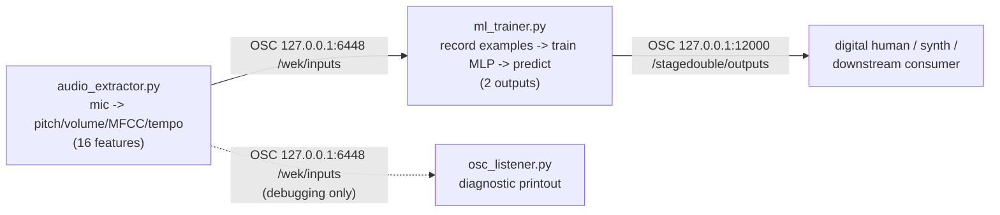

## Prototype vol.1

First prototype version of **StageDouble**: real-time vocal feature extraction from a live microphone, mapped through a trainable regression model to output parameters for a digital human, all in pure Python.

Wekinator was dropped from this pipeline — its Java Swing UI crashes on macOS Sonoma (Carbon menu incompatibility) — in favor of `ml_trainer.py`, a small terminal-based interactive machine learning tool that does the same job.

### What's in this version

- `audio/audio_extractor.py` — captures live mic audio, extracts pitch, volume, MFCC, and beat/tempo with librosa, and streams the 16-value feature vector over OSC.
- `audio/ml_trainer.py` — receives that feature vector, lets you record labeled examples from a terminal prompt, trains a small neural network regressor (scikit-learn `MLPRegressor`) on them, and streams its 2 predicted output parameters onward over OSC in real time.
- `audio/osc_listener.py` — a diagnostic listener that prints incoming OSC feature vectors with real numbers; useful for checking `audio_extractor.py` in isolation (run it *instead of* `ml_trainer.py`, not alongside it, since both listen on the same default port).
- `requirements.txt` — Python dependencies for this prototype.

### How the pieces connect



`audio_extractor.py` always runs first — it just sends features out over OSC regardless of who's listening. Then run either `ml_trainer.py` (to train and drive real output) or `osc_listener.py` (to sanity-check the feature stream by eye), not both at once.

### Setup

```bash
pip install -r requirements.txt
```

### Usage

Run these in separate terminals:

```bash
# terminal 1: capture mic audio and extract features
python audio/audio_extractor.py

# terminal 2: train a model on those features and predict outputs live
python audio/ml_trainer.py
```

In `ml_trainer.py`'s terminal prompt:

```
record <out1> <out2> [seconds]   hold a state and capture it for `seconds`
                                  (default 3), labeled with target output
                                  (out1, out2)
train                            fit the regressor on examples recorded so far
run                              start live prediction + OSC output
stop                             stop live prediction
status                           show example count / training state
clear                            discard all recorded examples
help                             show this message
quit                             shut down
```

Typical session: hold a vocal state and run `record 0 0 3`, hold a different state and run `record 1 1 3`, repeat with a few more states and target values, then `train`, then `run` to stream live predictions to whatever consumes them (default: `127.0.0.1:12000/stagedouble/outputs`).

macOS will prompt for microphone access on first run — approve it for your terminal/IDE under System Settings → Privacy & Security → Microphone.

Every script in `audio/` also has a bilingual (English/Chinese) header comment at the top explaining what it does, how to run it, and what it connects to — see the files themselves for full details.
